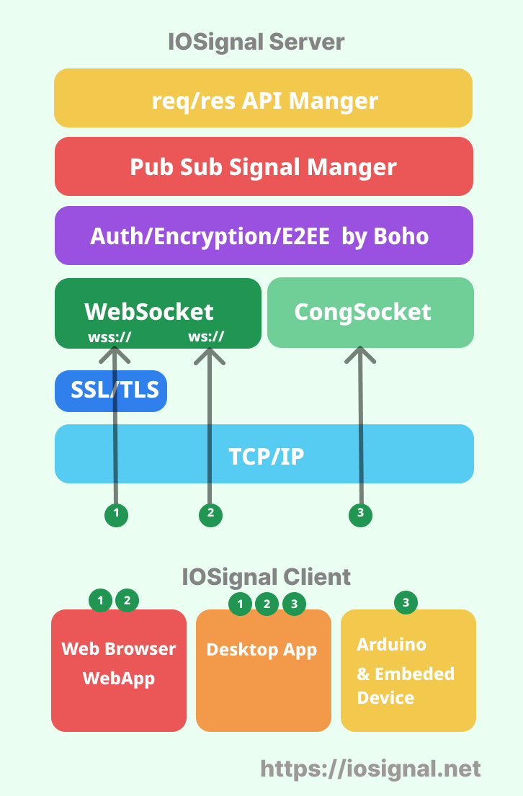

# Arduino IOSignal Client library

The Arduino iosignal library provides an Arduino client and example sources.

[kr]Arduino iosignal 라이브러리는 아두이노 client 및  예제소스를 제공합니다.

## iosignal
iosignal supports real-time communication between web browsers, node.js, and arduino. It also provides secure authentication and encrypted communication. The signaling protocol is built-in, so the server can be used without programming.

[Kr] iosignal 은 웹브라우저, node.js , arduino 간의 실시간 통신을 지원합니다. 또한 보안 인증과 암호통신 기능도 제공됩니다. 시그널링 프로토콜이 내장된 서버는 프로그래밍 없이도 사용 가능합니다.


## IOSignal Server

The iosignal server maintains the connection of multiple clients, relays data transmission and reception between clients, and is essential for iosignal communication.

You can run your own server, but for now, you can use the public server for testing.

If you want to run your own server in the future, you can use the [iosignal-cli](https://github.com/remocons/iosignal-cli) program. Please refer to the corresponding repository documentation for that information.

[kr] iosignal server 는 다수의 클라이언트의 접속을 유지하고,  클라이언트간의 데이타 송수신을 중계해주는 역활을 하며, iosgignal 통신시 꼭 필요합니다.
직접 운영할 수 도 있지만 일단은 공개된 서버를 사용하면됩니다.

차후 직접 서버를 운영하려면  [iosignal-cli](https://github.com/remocons/iosignal-cli) 을 이용하면 됩니다. 해당 정보는 해당 저장소 안내문을 참고하시기 바랍니다.
 


The test server used to connect to the Arduino is shown below.

[kr] 아두이노 접속시 사용될 테스트 서버는 아래와 같습니다.

```
url: io.iosignal.net
port: 55488
```


## Examples


The library comes with a number of example sketches. 

kr.본 라이브러리에는 간단한 시그널 송수신 예제가 포함되어 있습니다.

See `File` > `Examples` > `IOSignal` within the Arduino application.

### Server setup (서버 설정)

#### CASE 1. If you're using the default public server.
- Use the server access code as is, without modification.
- 공개 서버를 그대로 사용하는경우 기본 코드를 그대로 두면 됩니다.

```c
io.begin( &client , "io.iosignal.net", 55488);
```

#### CASE 2. the other server.
- If you're using a different server, change the server address and port number.
- 다른 서버를 사용할 경우 서버 주소와 포트번호를 변경해줍니다.

```c
io.begin( &client , "192.168.0.204", 55488);
```


## Control your Arduino with a webapp

 With iosignal client for javascript, you can use a web browser (webapp) to communicate with your Arduino.  Test it with a publicly available webapp!

[kr] iosignal client for javascript 를 사용하면 웹브라우저(웹앱)도 아두이노와 통신이 가능합니다.
 공개된 웹앱으로 테스트 해보세요!

### open the web app and try realtime communication.
- Connect to [http://test.iosignal.net](http://test.iosignal.net) using a web browser.
- Connect to the same server as your Arduino.
- warning. the port number is not equal to arduino using.
- Press the Send button on the web app to send a signal to the Arduino.
- Press the button on the Arduino to send signals and receive them on the web browser.


### [kr] 웹앱을 실행하여 테스트해보세요

- 웹브라우저로 [http://test.iosignal.net](http://test.iosignal.net) 에 접속합니다.
- 아두이노와 동일한 서버에 접속합니다.
- 주의. 아두이노 접속 포트와  웹브라우저 접속 포트번호는 다릅니다.
- 웹앱에서 전송 버튼을 눌러서 아두이노에 시그널을 송신합니다.
- 아두이노의 버튼을 눌러서 시그널을 보내고 웹브라우저에서 수신합니다.


##  IOSignal Features

### Built-in Message Transport Protocol
- pub/sub style multicast: by channel name.
- uni-cast: one to one messaging by CID.
- `CID` is a Communication Id.
- CID subscribing: subscribe one peer using CID.
- HomeChannel: group by IP address.

### Built-in Security
- Authentication
- Encryption
- E2EE
- thanks to the `Boho` [ [github](https://github.com/remocons/boho-arduino) ]


## Compatible Hardware

The library uses Stream for interacting with the
underlying network hardware. This means it Just Works with a growing number of
boards and shields, including:

### tested
 - Arduino Uno R3 + Ethernet Shield
 - Arduino Uno R4 WiFi
 - ESP8266
 - ESP32
 - ESP01


## IOSignal repositories.

- Javascript: `iosignal` [ [github](https://github.com/remocons/iosignal) | [npm](https://www.npmjs.com/package/iosignal) ]
    - Node.js server ( WebSocket, CongSocket)
    - Node.js client ( WebSocket, CongSocket)
    - Web Browser client( WebSocket)

- CLI program
    - `iosignal-cli` [ [github](https://github.com/remocons/iosignal-cli) | [npm](https://www.npmjs.com/package/iosignal-cli) ]
    - install: `npm i -g iosignal-cli` or `sudo npm i -g iosignal-cli`
    - support mac, linux and windows.
    - server and client

- Arduino iosignal library and examples:
    - use Arduino Library Manager: `iosignal`
    - or `iosignal-arduino` [ [github](https://github.com/remocons/iosignal-arduino) ]
    - web app : http://test.iosignal.net

- Arduino remocon library and examples:
    - use Arduino Library Manager: `remocon`
    - or `remocon-arduino` [ [github](https://github.com/remocons/remocon-arduino) ]
    - web app : https://remocon.kr

## IOSignal stack



## License

This code is released under the MIT License.